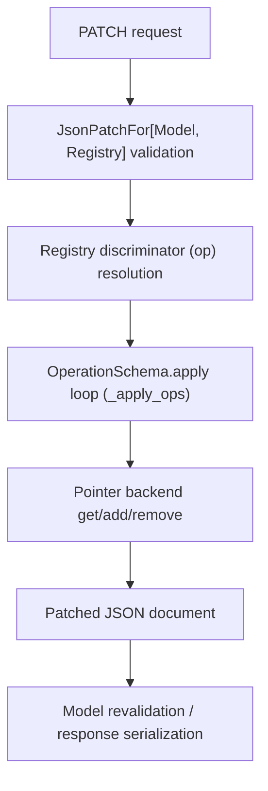

# Developer Reference

This section is for maintainers and advanced adopters working on internals,
extension points, and implementation constraints.

## Architecture Overview

Start with:

- [Local Docs Preview](developer-docs-preview.md)
- [Pointer Backends](pointer-backends.md)
- [Recursive Bound Limitation](recursive-bound-limitation.md)
